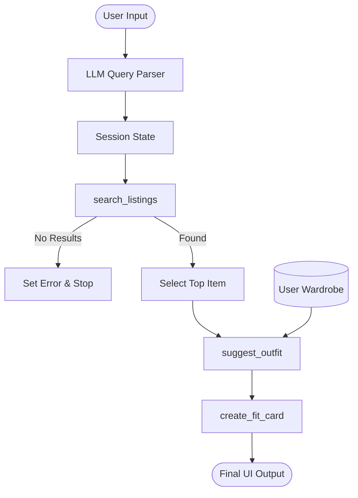

# FitFindr — planning.md

> Complete this document before writing any implementation code.
> Your spec and agent diagram are what you'll use to direct AI tools (Claude, Copilot, etc.) to generate your implementation — the more specific they are, the more useful the generated code will be.
> Your planning.md will be reviewed as part of your submission.
> Update it before starting any stretch features.

---

## Tools

List every tool your agent will use. For each tool, fill in all four fields.
You must have at least 3 tools. The three required tools are listed — add any additional tools below them.

### Tool 1: search_listings

**What it does:**
Searches the mock listings dataset for items matching the description, filtering by optional size and price, and sorting by keyword relevance.

**Input parameters:**
- `description` (str): Keywords describing what the user is looking for (e.g., "vintage graphic tee").
- `size` (str | None): Size string to filter by, case-insensitive (e.g., "M" matches "S/M").
- `max_price` (float | None): Maximum price ceiling (inclusive).

**What it returns:**
A list of matching listing dicts, sorted by keyword overlap score (highest first). Each dict contains fields like id, title, description, category, price, etc.

**What happens if it fails or returns nothing:**
Returns an empty list. The agent will detect this and stop the process, informing the user that no matches were found.

---

### Tool 2: suggest_outfit

**What it does:**
Uses an LLM to suggest 1–2 complete outfits combining a newly found thrifted item with the user's existing wardrobe items.

**Input parameters:**
- `new_item` (dict): The listing dictionary for the item the user is considering.
- `wardrobe` (dict): A dictionary containing a list of the user's wardrobe items.

**What it returns:**
A string containing the outfit suggestions, including specific pieces from the wardrobe if available.

**What happens if it fails or returns nothing:**
If the wardrobe is empty, it returns a string with general styling advice and vibe descriptions for the new item.

---

### Tool 3: create_fit_card

**What it does:**
Generates a short, catchy social media caption (2-4 sentences) for the suggested outfit using an LLM.

**Input parameters:**
- `outfit` (str): The outfit suggestion string from `suggest_outfit`.
- `new_item` (dict): The listing dictionary for the thrifted item.

**What it returns:**
A string usable as an Instagram or TikTok caption, mentioning the item, price, and platform.

**What happens if it fails or returns nothing:**
If the outfit input is empty or missing, it returns a descriptive error message string.

---

### Additional Tools (if any)

#### Tool 4: estimate_price_fairness
**What it does:**
Estimates whether an item's price is fair compared to similar listings in the dataset.

**Input parameters:**
- `item` (dict): The listing dictionary for the item to evaluate.

**What it returns:**
A string analysis comparing the item's price to the average of comparable items (matched by Brand, then Category/Styles).

#### Tool 5: get_current_trends
**What it does:**
Fetches recent fashion trends from a persistent cache or via a fresh search if the cache is older than 7 days.

**Input parameters:**
None.

**What it returns:**
A list of current fashion trend strings.

---

## Planning Loop

**How does your agent decide which tool to call next?**
The agent follows a deterministic linear pipeline for each query:
1. **Initialize Session**: Create a state object to hold all data.
2. **Parsing**: The agent first parses the natural language query into `description`, `size`, and `max_price` (using an LLM for robust extraction).
3. **Search with Retry**: It calls `search_listings`. If no results, it automatically retries by loosening filters in order: Style -> Price -> Size.
4. **Conditional Branch**:
   - If search results are STILL empty: Set an error message and terminate the loop.
   - If results are found: Pick the top-scoring item and proceed.
5. **Price Analysis**: Call `estimate_price_fairness` for the selected item.
6. **Trends**: Call `get_current_trends` to fetch/cache recent fashion trends.
7. **Suggest Outfit**: Call `suggest_outfit` with the item, wardrobe, and trends.
8. **Create Fit Card**: Call `create_fit_card` using the suggestion and item details.
9. **Finalization**: Return the full session state to the UI.

---

## State Management

**How does information from one tool get passed to the next?**
A `session` dictionary is used as the central state container.
- `query`: The raw user input.
- `parsed`: The extracted filters used by `search_listings`.
- `search_results`: The full list of matches.
- `selected_item`: The specific item (top match) used for styling.
- `price_analysis`: Output from `estimate_price_fairness`.
- `trend_insights`: List of trends from `get_current_trends`.
- `wardrobe`: Loaded from database (Style Profile Memory), used by `suggest_outfit`.
- `outfit_suggestion`: Output from `suggest_outfit`, used by `create_fit_card`.
- `fit_card`: Final output string.
- `modifications`: Tracks filter loosening during Retry Logic.
- `error`: Tracks if the process should stop early.

---

## Error Handling

For each tool, describe the specific failure mode you're handling and what the agent does in response.

| Tool | Failure mode | Agent response |
|------|-------------|----------------|
| search_listings | No results match the query | Set `session["error"]` to "No matches found for your search. Try different keywords or filters." and return early. |
| suggest_outfit | Wardrobe is empty | Prompt the LLM to provide "general styling advice" instead of specific wardrobe pairings. |
| create_fit_card | Outfit input is missing or incomplete | Return "Could not generate fit card due to missing outfit details." |

---

## Architecture

---

## AI Tool Plan

**Milestone 3 — Individual tool implementations:**
- **search_listings**: I'll implement this manually using Python. Logic: filter `load_listings()` by price and size (regex/substring), then calculate a score based on how many words in the `description` query appear in the listing's `title`, `description`, and `style_tags`. Sort and return.
- **suggest_outfit**: I'll use the Groq LLM. Input: `new_item` details and `wardrobe` items. Prompt: "You are a stylist. Here is a new item and a user's wardrobe. Suggest 2 outfits." If wardrobe is empty: "Suggest general styling advice."
- **create_fit_card**: I'll use the Groq LLM with a high temperature. Input: `new_item` and the `outfit` text. Prompt: "Write a 2-4 sentence IG caption. Mention the item, price, and platform. Keep it casual."

**Milestone 4 — Planning loop and state management:**
- **Query Parsing**: I'll use Groq to convert the natural language query into a JSON object with `description`, `size`, and `max_price`. This handles variations like "under $30" or "price < 30".
- **run_agent**: I'll implement the logic in `agent.py` to sequence the calls and handle the empty-search-results exit.

---

## A Complete Interaction (Step by Step)

FitFindr is an AI-powered personal stylist that helps users find secondhand clothing and style them with their existing wardrobe. It searches for items based on a user's natural language query (triggering `search_listings`), suggests outfits combining a found item with the user's wardrobe (triggering `suggest_outfit`), and generates a shareable social media caption (triggering `create_fit_card`). If no matching items are found during the search phase, the process terminates early with a helpful message to the user, ensuring no empty or irrelevant suggestions are made.

Write out what a full user interaction looks like from start to finish — tool call by tool call. Use a specific example query.

**Example user query:** "I'm looking for a vintage graphic tee under $30. I mostly wear baggy jeans and chunky sneakers. What's out there and how would I style it?"

**Step 1:**
The agent parses the query: `description="vintage graphic tee"`, `max_price=30.0`, `size=None`.
It calls `search_listings(description="vintage graphic tee", max_price=30.0)`.
It returns `lst_006` ("Graphic Tee — 2003 Tour Bootleg Style", $24).

**Step 2:**
The agent calls `suggest_outfit(new_item=lst_006, wardrobe=example_wardrobe)`.
The LLM suggests: "Pair this bootleg tee with your Baggy straight-leg jeans (w_001) and Chunky white sneakers (w_007) for a full streetwear vibe."

**Step 3:**
The agent calls `create_fit_card(outfit="...", new_item=lst_006)`.
The LLM returns: "Just copped this 2003 tour bootleg tee for only $24 on Depop! 🎸 Pairing it with my favorite baggy jeans and chunky white sneakers for that effortless vintage streetwear look. #ThriftFinds #OOTD"

**Final output to user:**
The UI displays the listing for the 2003 Tour Bootleg Style tee, the outfit suggestion with the baggy jeans/sneakers, and the "Just copped..." caption.
