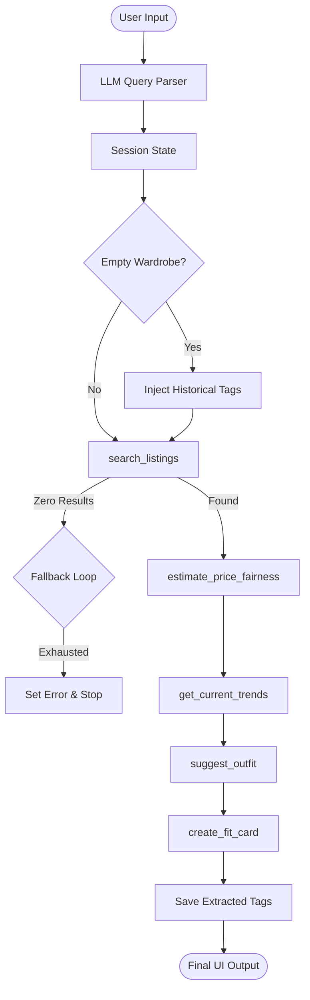

# FitFindr — planning.md

> Complete this document before writing any implementation code.
> Your spec and agent diagram are what you'll use to direct AI tools (Claude, Copilot, etc.) to generate your implementation — the more specific they are, the more useful the generated code will be.
> Your planning.md will be reviewed as part of your submission.
> Update it before starting any stretch features.

---

## Tools

List every tool your agent will use. For each tool, fill in all four fields.
You must have at least 3 tools. The three required tools are listed — add any additional tools below them.

### Tool 1: search_listings

**What it does:**
Searches the mock listings dataset for items matching the description, filtering by optional size and price, and sorting by keyword relevance. It uses strict whole-word 'AND' logic, meaning every keyword in the description must match as a whole word in the title, description, or style tags.

**Input parameters:**
- `description` (str): Keywords describing what the user is looking for (e.g., "vintage graphic tee").
- `size` (str | None): Size string to filter by, case-insensitive (e.g., "M" matches "S/M").
- `max_price` (float | None): Maximum price ceiling (inclusive).

**What it returns:**
A list of matching listing dicts, sorted by keyword occurrence frequency (highest first). If no items match, it returns an empty list `[]`.

**What happens if it fails or returns nothing:**
Returns an empty list `[]`. The agent planning loop will then trigger its fallback state machine to loosen constraints or terminate early.

---

### Tool 2: suggest_outfit

**What it does:**
Uses an LLM to suggest 1–2 complete outfits combining a newly found thrifted item with the user's existing wardrobe items. It provides personalized styling advice for empty wardrobes by utilizing historical preferences.

**Input parameters:**
- `new_item` (dict): The listing dictionary for the item the user is considering.
- `wardrobe` (dict): A dictionary containing a list of the user's wardrobe items (key: `items`). It also expects `trend_insights` (list) and `historical_preferences` (list) to be nested safely within this dictionary wrapper to satisfy the two-parameter function signature.

**What it returns:**
A string containing the outfit suggestions, including specific pieces from the wardrobe if available. It also appends extracted vibe tags using the `EXTRACTED_TAGS:` delimiter.

**What happens if it fails or returns nothing:**
If the `items` list is empty, it returns a string with general styling advice and vibe descriptions tailored to the user's `historical_preferences` and `trend_insights`.

---

### Tool 3: create_fit_card

**What it does:**
Generates a short, catchy, and shareable social media caption (2-4 sentences) for an Instagram or TikTok OOTD post using an LLM.

**Input parameters:**
- `outfit` (str): The outfit suggestion string from `suggest_outfit`.
- `new_item` (dict): The listing dictionary for the thrifted item.

**What it returns:**
A 2-4 sentence string usable as a caption, naturally mentioning the item, price, and platform.

**What happens if it fails or returns nothing:**
If the outfit input is empty or missing, it returns a descriptive error message string: "Could not generate fit card due to missing outfit details."

---

### Additional Tools (if any)

#### Tool 4: estimate_price_fairness
**What it does:**
Estimates whether an item's price is fair using fine-grained product detection and a two-tier outlier-protected pricing strategy (Tier 1: Brand + Type, Tier 2: Market-wide Type fallback).

**Input parameters:**
- `item` (dict): The listing dictionary for the item to evaluate.

**What it returns:**
A string analysis comparing the item's price to the average of comparable items, including a fairness rating (e.g., "a steal! 💎", "fairly priced. 👍", or "expensive... 💸").

#### Tool 5: get_current_trends
**What it does:**
Fetches recent fashion trends (2024-2025) from a persistent database cache. It uses a 7-day TTL (Time-To-Live) layer; if the cache is expired or missing, it performs a simulated search loop using an LLM to refresh the data.

**Input parameters:**
None.

**What it returns:**
A list of current fashion trend strings (e.g., ["Boho Chic", "Burgundy", "Denim on denim"]).

---

## Planning Loop

**How does your agent decide which tool to call next?**
The agent follows a deterministic linear pipeline with an integrated fallback state machine:

1. **Initialize Session & Style Injection**: Create a session state. If the user's `wardrobe["items"]` is empty, the agent pulls historical style tags from persistent storage and injects them into `wardrobe["historical_preferences"]`.
2. **Parsing**: Uses an LLM to parse the query into `description`, `size`, and `max_price`.
3. **Search with Fallback State Machine**: Calls `search_listings`. If it returns `[]`, the agent progressively sheds constraints:
   - **Step A (Style)**: Broaden style keywords by dropping the first token of the description string using a token-split heuristic.
   - **Step B (Price)**: Remove the `max_price` ceiling.
   - **Step C (Size)**: Remove the `size` requirement.
   Each change is logged in `session["modifications"]`.
4. **Conditional Early Termination**: If search results remain empty after all fallback steps, `session["error"]` is set and the agent terminates immediately, skipping downstream tools.
5. **Execution Pipeline**:
   - Call `estimate_price_fairness` for the top item.
   - Call `get_current_trends` to fetch/cache trend data.
   - Call `suggest_outfit` (passing trends/history via the wardrobe wrapper).
   - Call `create_fit_card`.
6. **Persistence**: Extracted tags from the suggestion are saved to the user's Style Profile.

---

## State Management

**How does information from one tool get passed to the next?**
A `session` dictionary acts as the central state container:
- `query`: Original user input.
- `user_id`: Identifier for Style Profile Memory.
- `parsed`: JSON object with extracted search filters.
- `search_results`: List of matches from `search_listings`.
- `selected_item`: The top match used for downstream tools.
- `price_analysis`: Output from `estimate_price_fairness`.
- `trend_insights`: List of trends from `get_current_trends`, also injected into `wardrobe`.
- `wardrobe`: User's wardrobe data, enriched with `historical_preferences` if empty.
- `outfit_suggestion`: Output from `suggest_outfit` (minus vibe tags).
- `extracted_tags`: Vibe tags parsed from `suggest_outfit` to update Style Profile.
- `fit_card`: Final caption from `create_fit_card`.
- `modifications`: List of strings tracking filter loosening steps.
- `error`: Error message string that triggers the early-termination UI switch.

---

## Error Handling

For each tool, describe the specific failure mode you're handling and what the agent does in response.

| Tool | Failure mode | Agent response |
|------|-------------|----------------|
| search_listings | No results match the query | Trigger fallback state machine (Loosen Style -> Price -> Size). If still empty, set `session["error"]` to a helpful message and terminate. |
| suggest_outfit | Wardrobe is empty | Inject `historical_preferences` from Style Profile and prompt LLM for trend-aware "general styling advice." |
| estimate_price_fairness | Insufficient data | Return "This item's value is unique, and we don't have enough marketplace data... yet." |
| create_fit_card | Outfit input is missing | Return "Could not generate fit card due to missing outfit details." |
| get_current_trends | API/Cache failure | Fallback to a hardcoded list of stable trends (e.g., "Boho Chic", "Denim"). |

### Early-Termination Walkthrough: 'Designer Ballgown'
1. **Query**: "Looking for a designer ballgown size XXS under $5"
2. **Search 1**: `search_listings("designer ballgown", "XXS", 5.0)` -> `[]`.
3. **Retry A (Style)**: `search_listings("ballgown", "XXS", 5.0)` -> `[]`. Log modification.
4. **Retry B (Price)**: `search_listings("ballgown", "XXS", None)` -> `[]`. Log modification.
5. **Retry C (Size)**: `search_listings("ballgown", None, None)` -> `[]`. Log modification.
6. **Termination**: `session["error"]` set to "No items found... even after broadening our filters." Execution stops.

---

## Architecture

---

## AI Tool Plan

**Milestone 3 — Individual tool implementations:**
- **search_listings**: I'll implement this manually using Python/Regex to ensure strict 'AND' whole-word matching.
- **suggest_outfit**: I'll provide an LLM with the Tool 2 spec from `planning.md` (inputs, outputs, and failure modes) to generate the prompt engineering logic. I'll verify that it handles the empty wardrobe case by checking that the prompt incorporates `historical_preferences` and `trend_insights` when items are missing.
- **create_fit_card**: I'll use an AI tool to generate the Groq API call, providing the Tool 3 spec. I'll verify the temperature is set high (0.9) to ensure variety in captions as per the rubric.

**Milestone 4 — Planning loop and state management:**
- **Query Parsing**: I'll use an AI tool to write the `_parse_query` function, giving it the specific JSON schema required in the spec. I'll verify the output is strictly JSON by enforcing the `response_format`.
- **estimate_price_fairness**: I'll manually implement the two-tier pricing logic to ensure exact control over the outlier protection (20%-300% median) and the keyword-based product detection.
- **run_agent (Planning Loop)**: I'll give an AI tool the Architecture diagram and the Planning Loop section from `planning.md`. I'll verify that the generated code correctly branches on the `search_listings` results and implements the multi-step fallback retry logic before terminating early on persistent zero results.

---

## A Complete Interaction (Step by Step)

FitFindr is an AI-powered personal stylist that helps users find secondhand clothing and style them with their existing wardrobe. It searches for items based on a user's natural language query, suggests outfits combining a found item with the user's wardrobe, and generates a shareable social media caption.

**Example user query:** "I'm looking for a vintage graphic tee under $30. I mostly wear baggy jeans and chunky sneakers. What's out there and how would I style it?"

**Step 1: Parsing**
The agent parses the query: `description="vintage graphic tee"`, `max_price=30.0`, `size=None`.

**Step 2: Search**
It calls `search_listings(description="vintage graphic tee", max_price=30.0)`.
It returns `lst_006` ("Graphic Tee — 2003 Tour Bootleg Style", $24).

**Step 3: Fairness & Trends**
`estimate_price_fairness` evaluates the $24 price against other "tees" and returns "This tee is priced at $24.00. Comparable tees average around $22.50. We consider this price to be fairly priced. 👍"
`get_current_trends` returns `["Streetwear", "Vintage Graphic Prints", ...]`.

**Step 4: Suggestion**
The agent calls `suggest_outfit(new_item=lst_006, wardrobe=...)`.
The LLM suggests: "Pair this bootleg tee with your Baggy straight-leg jeans and Chunky white sneakers for a full streetwear vibe. EXTRACTED_TAGS: Streetwear, Vintage-Core"

**Step 5: Fit Card**
The agent calls `create_fit_card(outfit="...", new_item=lst_006)`.
The LLM returns: "Just copped this 2003 tour bootleg tee for only $24 on Depop! 🎸 Pairing it with my favorite baggy jeans and chunky white sneakers for that effortless vintage streetwear look."

**Final output to user:**
The UI displays the listing for the tee, the price analysis, the outfit suggestion, and the "Just copped..." caption.
